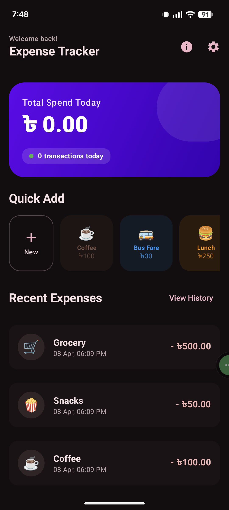
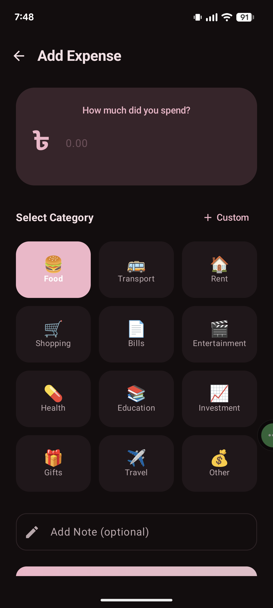
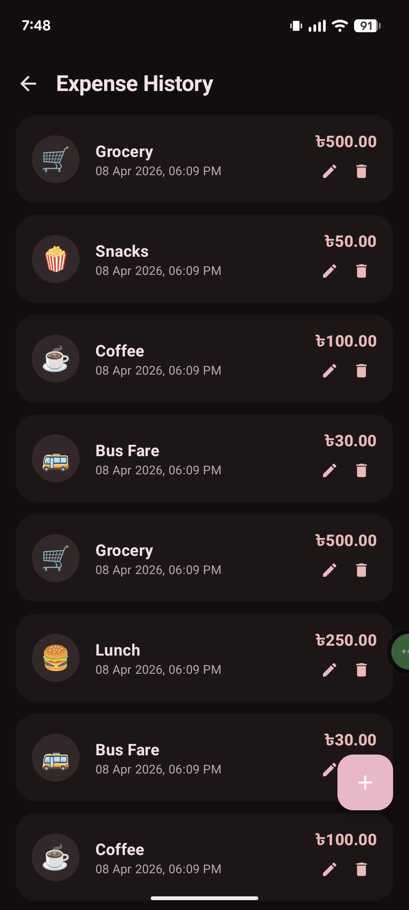

# Expense Tracker - Daily Budget

A modern, sleek, and intuitive Expense Management application built with **Jetpack Compose** and **Material 3**. Effortlessly track your daily spending, manage quick expenses, and visualize your financial habits.

### [Install From PlayStore](https://play.google.com/store/apps/details?id=com.mihab.expensetracker)

## Features

- **Comprehensive Tracking:** Log your expenses with category, date, and detailed notes.
- **Quick Expenses:** Create custom shortcuts for your most frequent spends with icons and custom colors.
- **Multi-language Support:** Fully localized in **English** and **Bengali (বাংলা)**.
- **Currency Customization:** Switch between multiple currencies (৳, $, €, £, ₹) to match your region.
- **Modern UI:** Clean, responsive, and accessible interface following Material 3 guidelines.
- **Theme Support:** Beautifully integrated themes with edge-to-edge support.
- **Local Storage:** Powered by **Room Database** for offline-first performance and data security.
- **Video Tutorial:** Built-in link to a video guide to help you get started quickly.

## Tech Stack

- **UI Framework:** [Jetpack Compose](https://developer.android.com/jetpack/compose)
- **Programming Language:** [Kotlin](https://kotlinlang.org/)
- **Architecture:** MVVM (Model-View-ViewModel)
- **Database:** [Room Persistence Library](https://developer.android.com/training/data-storage/room)
- **Navigation:** [Compose Navigation](https://developer.android.com/jetpack/compose/navigation)
- **Dependency Management:** Kotlin DSL & Version Catalog
- **Visuals:** [MPAndroidChart](https://github.com/PhilJay/MPAndroidChart) for data visualization
- **Splash Screen:** [Core SplashScreen API](https://developer.android.com/develop/ui/views/launch/splash-screen)

## Screenshots

|          Home Screen          |                         Add Expense                          |                                     Expanse History                                     |
|:-----------------------------:|:------------------------------------------------------------:|:---------------------------------------------------------------------------------------:|
|  |  |  |

*(Note: Replace these placeholders with actual screenshots from the `screenshots/` folder)*

## Getting Started

### Prerequisites

- Android Studio Koala or newer
- JDK 17
- Android SDK 24+ (Android 7.0 Nougat)

### Installation

1. **Clone the repository:**
   ```bash
   git clone https://github.com/mihabgit/expanse-tracker.git
   ```
2. **Open the project** in Android Studio.
3. **Sync the project** with Gradle files.
4. **Run the app** on an emulator or physical device.

## 📂 Project Structure

```text
app/src/main/java/com/mihab/expensetracker/
├── data/
│   ├── local/      # Room Database, DAOs, and Entities
│   └── repository/ # Repository pattern for data abstraction
├── ui/
│   ├── screens/    # Composable screens (Home, Settings, etc.)
│   └── theme/      # Material 3 Theme definitions
├── util/           # Helpers (LocaleHelper, etc.)
├── viewmodel/      # Architecture components
└── MainActivity.kt # Entry point
```

## Contributing

Contributions are welcome! If you find a bug or have a feature request, please open an issue or submit a pull request.

1. Fork the Project
2. Create your Feature Branch (`git checkout -b feature/AmazingFeature`)
3. Commit your Changes (`git commit -m 'Add some AmazingFeature'`)
4. Push to the Branch (`git push origin feature/AmazingFeature`)
5. Open a Pull Request

## License

Distributed under the MIT License. See `LICENSE` for more information.

---
Created with ❤️ by [Imran](https://github.com/mihabgit)
